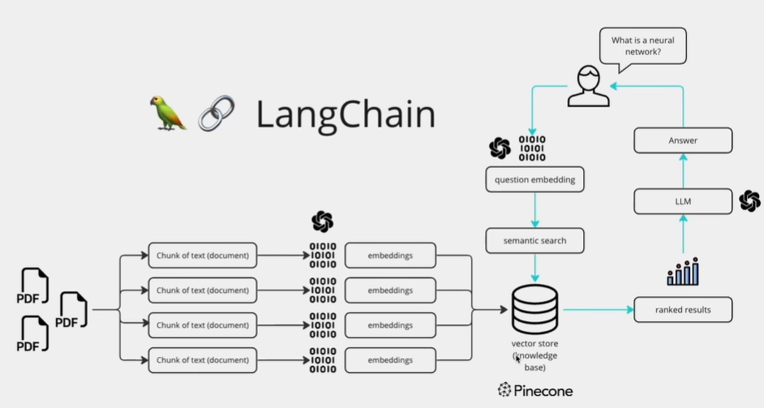

# Multi-PDF RAG Chatbot

An AI-powered Retrieval-Augmented Generation (RAG) application that allows users to upload multiple PDF documents and interact with them through natural language conversations.

The application extracts text from PDFs, converts it into vector embeddings using Google's Gemini embedding model, stores them in a FAISS vector database, and retrieves relevant context to answer user queries accurately.

---

## Features

* Upload multiple PDF documents simultaneously
* Extract and preprocess PDF text
* Chunk documents for efficient retrieval
* Generate embeddings using Gemini
* Store embeddings in a FAISS vector database
* Conversational question answering
* Persistent chat history during the session
* Interactive Streamlit UI

---

## Tech Stack

### Frontend

* Streamlit

### AI / LLM

* Google Gemini
* LangChain

### Vector Database

* FAISS

### Document Processing

* PyPDF

### Environment Management

* Python Dotenv

---

## Architecture



## Project Workflow

1. User uploads one or more PDF files.
2. Text is extracted from each document.
3. Documents are split into smaller chunks.
4. Gemini embedding model converts chunks into vectors.
5. FAISS stores the vectors for similarity search.
6. User asks a question.
7. Relevant chunks are retrieved.
8. Gemini generates a context-aware answer.
9. Conversation history is maintained throughout the session.

---

### File Responsibilities

| File             | Responsibility             |
| ---------------- | -------------------------- |
| app.py           | Main Streamlit application |
| requirements.txt | Python dependencies        |
| .env             | Stores Gemini API key      |
| .gitignore       | Ignore sensitive files     |
| README.md        | Project documentation      |

---

## Installation

### Clone Repository

```bash
git clone https://github.com/acecitruslion/ask-multiple-pdfs.git

cd ask-multiple-pdfs
```

### Create Virtual Environment

```bash
python -m venv .venv
```

### Activate Environment

Windows

```bash
.venv\Scripts\activate
```

Mac/Linux

```bash
source .venv/bin/activate
```

### Install Dependencies

```bash
pip install -r requirements.txt
```

---

## Environment Variables

Create a `.env` file.

```env
GOOGLE_API_KEY=your_api_key
```

---

## Run Application

```bash
streamlit run app.py
```

Open:

```text
http://localhost:8501
```

---

## Future Improvements

* Source citations for answers
* PDF preview support
* Persistent vector database
* Authentication
* Multi-user support
* Conversation export

---

## Key Learnings

* Retrieval-Augmented Generation (RAG)
* LangChain Conversational Retrieval
* FAISS Vector Databases
* Gemini Embeddings
* Streamlit Application Development
* Session State Management
* PDF Processing Pipelines